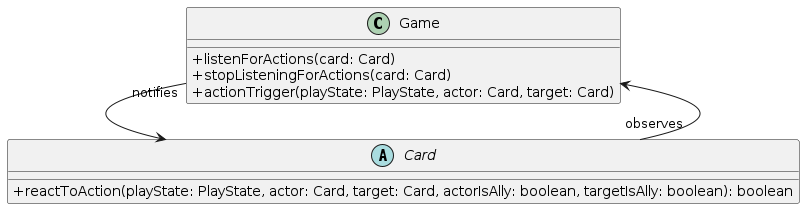

# SENG301 Assignment 4 (2023) - Student answers

**YOUR NAME**

## Task 1 - Identify the patterns in the code

### EXAMPLE PATTERN (this pattern is given as an example)

#### What pattern is it?

Proxy

#### What is its goal in the code?

This proxy pattern is used in the Yu-Gi-Oh app to:

- obtain real cards from an external system (Yu-Gi-Oh API), i.e. access control to cards supplied by API;
- create cards on demand, pruning what is not needed from the retrieved cards before passing them.

#### Name of UML Class diagram attached

./diagrams/yugioh-domain.png

#### Mapping to GoF pattern elements

| GoF element | Code element        |
| ----------- | ------------------- |
| Client      | BattleDeckCreator   |
| Subject     | CardGenerator       |
| Proxy       | CardProxy           |
| RealSubject | CardService         |
| request()   | getRandomCard()     |
| request()   | getRandomCardOfType |

### Pattern 1

#### What pattern is it?

Observer

#### What is its goal in the code?

- so that when ever a action is taken in the game the cards of that game can react to the action.
- allows cards to activate there ability's.

#### observer.png 
class Game {
+listenForActions(card: Card)
+stopListeningForActions(card: Card)
+actionTrigger(playState: PlayState, actor: Card, target: Card)
}

abstract class Card {
+reactToAction(playState: PlayState, actor: Card, target: Card, actorIsAlly: boolean, targetIsAlly: boolean): boolean
}

Card -d* Game

#### Mapping to GoF pattern elements

| GoF element      | Code element                                                                                                                                          |
|------------------|-------------------------------------------------------------------------------------------------------------------------------------------------------|
| Subject          | Game                                                                                                                                                  |
| ConcreteSubject  | Game	(no seprate of concreate and non-concreate)                                                                                                      | 
 | subjectState     | action (not stored long term)                                                                                                                         |
| attach           | listenForActions                                                                                                                                      |
| detach           | stopListeningForActions                                                                                                                               |
| notify           | actionTrigger                                                                                                                                         |
| Observer         | Card                                                                                                                                                  |
| ConcreteObserver | Card   (allthough Card is an abstract the implentation of the reactToAction is defined in card and non of it's children overright that implentation.) |
| update           | reactToAction                                                                                                                                         |
| observerState    |                                                                                                                                                       |

### Pattern 2

#### What pattern is it?
TODO wright use other example (e.g use the decorator in the Abbilitys)

**Decorator**

#### What is its goal in the code?
- to make it so that Ability's can be easily made with a verity of conditions and effects.
- make it so any arbitrary combination of conditions and effects can be used for an abblity.

#### Decorator.png
Interface Ability {
execute(abilityCard: Card, playState: PlayState, actor: Card, target: Card, actorIsAlly: boolean,targetIsAlly: boolean)
}

abstract class AbstractAbility {
#ability: Ability
}

AbstractAbility -|> Ability
Ability -* AbstractAbility

class BasicAbility {
+execute(abilityCard: Card, playState: PlayState, actor: Card, target: Card, actorIsAlly: boolean,targetIsAlly: boolean)
}

BasicAbility -|> Ability

class TotalTimes {
-numberOfTimesToTrigger: int
+execute(abilityCard: Card, playState: PlayState, actor: Card, target: Card, actorIsAlly: boolean,targetIsAlly: boolean)
+getNumberOfTimesToTrigger()
}

TotalTimes -u|> AbstractAbility

only includes one of the many concrete decorators.

#### Mapping to GoF pattern elements

| GoF element        | Code element              |
|--------------------|---------------------------|
| Component          | Ability                   |
| ConcreteComponent  | BasicAbility              |
| operation          | execute                   |
| Decorator          | AbstractAbility           |
| ConcreteDecoratorA | TotalTimes                |
| addedStateA        | numberOfTimesToTrigger    |
| addedBehaviorA     | getNumberOfTimesToTrigger |
| ConcreteDecoratorB | ActorIsAllyOrEnemy        |
| addedStateB        | isAlly                    |
| ConcreteDecoratorC | CanTargetSelf             |
| addedStateC        | canTriggerOnSelf          |
| ConcreteDecoratorD | OnlyIfPlayState           |
| addedStateD        | playStates                |
| ConcreteDecoratorE | OnlyOnType                |
| addedStateE        | classes                   |
| ConcreteDecoratorF | TargetActor               |
| ConcreteDecoratorG | TargetIsAllyOrEnemy       |
| addedStateG        | isAlly                    |

## Task 2 - Full UML Class diagram

### retroDoucument.svg

## Task 3.1 - Implement new feature (CardResponse)

### What pattern fulfils the need for the feature?

**Factory Method**

### What is its goal and why is it needed here?

**So that the code for creating different types of card can be separated**

### Name of UML Class diagram attached

only includes instance of monster and monster creator for inltratoin purposes.
### Mapping to GoF pattern elements

| GoF element      | Code element   |
|------------------|----------------|
| Product          | Card           |
| Creator          | CardCreator    |
| FactoryMethod    | toCard         | 
| ConcreteProductA | Monster        |
| ConcreteCreatorA | MonsterCreator |
| ConcreteProductB | Spell          |
| ConcreteCreatorB | SpellCreator   |
| ConcreteProductC | Trap           |
| ConcreteCreatorC | TrapCreator    |

## Task 3.2 - Implement new feature (PlayStyle)

### What pattern fulfils the need for the feature?

**strategy**

### What is its goal and why is it needed here?

- so that multiple types of AI's can exist each with different behaviours.
- so that the different AI's all have to follow the same rules which is defined in the game.

### strategy.png

left to right direction

skinparam classAttributeIconSize 0

interface PlayerAIOperation {
+execute(allyBoard: Board, enemyBoard: Board, numCardsPlayed: int): Action
}

class Player {

}

PlayerAIOperation -u* Player

basicAI -u|> PlayerAIOperation
monsterFavouringAI -u|> PlayerAIOperation
setupFavouringAI -u|> PlayerAIOperation
recklessAI -u|> PlayerAIOperation

### Mapping to GoF pattern elements

| GoF element       | Code element       |
|-------------------|--------------------|
| Strategy          | PlayerAIOperation  |
| execute           | execute            |
| Context           | Player             |
| ConcreteStrategyA | basicAI            |
| ConcreteStrategyB | monsterFavouringAI |
| ConcreteStrategyC | setupFavouringAI   |
| ConcreteStrategyD | recklessAI         |

## Task 4 - BONUS - Acceptance tests for Task 4

### Feature file (Cucumber Scenarios)

**NAME OF FEATURE FILE**

### Java class implementing the acceptance tests

**NAME OF JAVA FILE**
